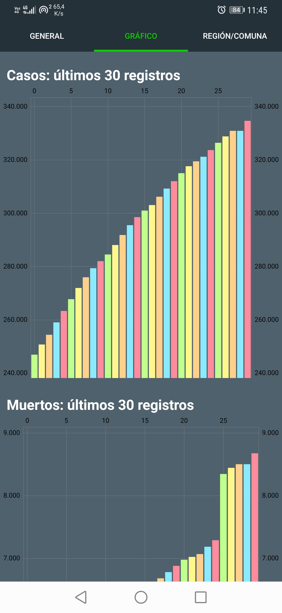
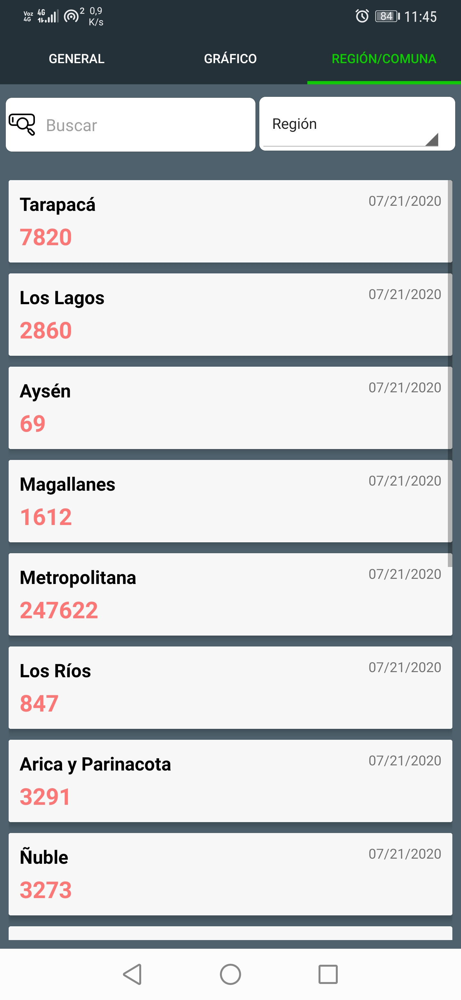

# Info Coronavirus

_Aplicación que permite mostrar información sobre la pandemia en Chile, mostrando casos por día a nivel nacional, recuperados, fallecidos y datos similares, además se muestra un gráfico con datos de los últimos 30 días para los casos y los fallecidos. Adicionalmente es posible ver los casos por regiones y comunas._


<p align="center">
  

  


</p>

### Pre-requisitos 📋

_Acceso a internet_


### Instalación 🔧

_Es necesario contar con android studio para el caso de clonar el proyecto, de lo contrario es necesaria la apk para su instalación directa_

_AndroidStudio_

```
Instala AndroidStudio, en el dispositivo móvil habilita el modo desarrollador a través de configuración->Acerca del dispositivo-> presionar varias veces "número de compilación" hasta que se indique que el modo desarrollador está habilitado. 
Posteriormente, al volver al menú principal se mostrará la opción de "opciones de programador", debes ingresar a la opción y habilitar la "depuración usb".

Para finalizar conectar el dispositvo al equipo a través del cable usb, abrir el proyecto en android studio y correr el programa.
```

_Instalar apk_

```
Conecta el dispositivo móvil al equipo y copia el archivo de aplicación a éste. Luego desconecta el móvil, accede a la ruta e instala la aplicación.
```

## Despliegue 📦

_No presenta requisitos adicionales, solo es necesaria la aplicación y un dispositivo móvil_

## Construido con 🛠️

* [AndroidStudio](https://developer.android.com/studio) - El framework para móviles más usado
* [Maven](https://maven.apache.org/) - Manejador de dependencias
* [Lottie](https://lottiefiles.com/) - Imágenes animadas
* [Retrofit] (https://square.github.io/retrofit/) - A type-safe HTTP client for Android and Java


## Autores ✒️

_Equipo de excelentes intelectuales_

* **Erick Oyarce** - *Desarrollador*


## Licencia 📄

Libre

## Expresiones de Gratitud 🎁

* Comenta a otros sobre este proyecto 📢
* Invita una cerveza 🍺 o un café ☕ a alguien del equipo. 
* Da las gracias públicamente 🤓.
* etc.


---
⌨️ con ❤️ 😊